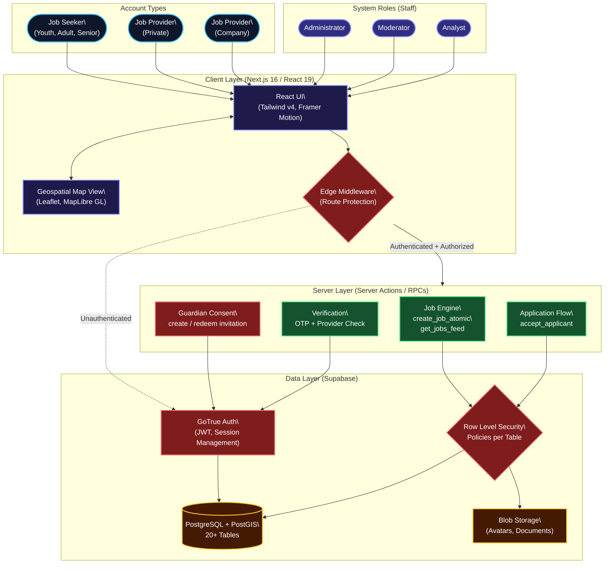
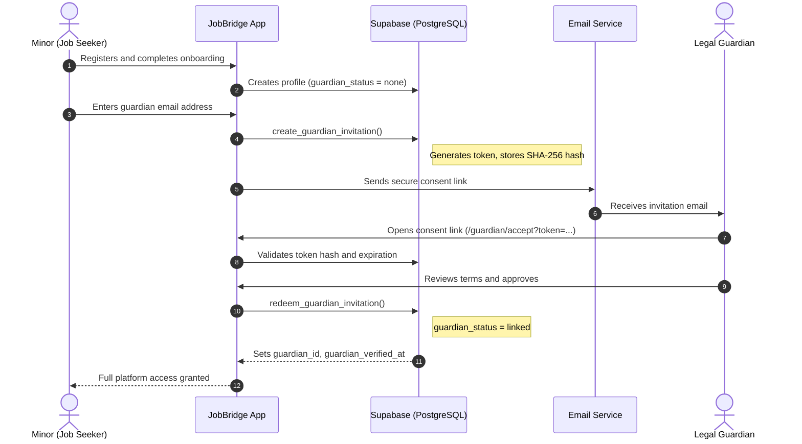
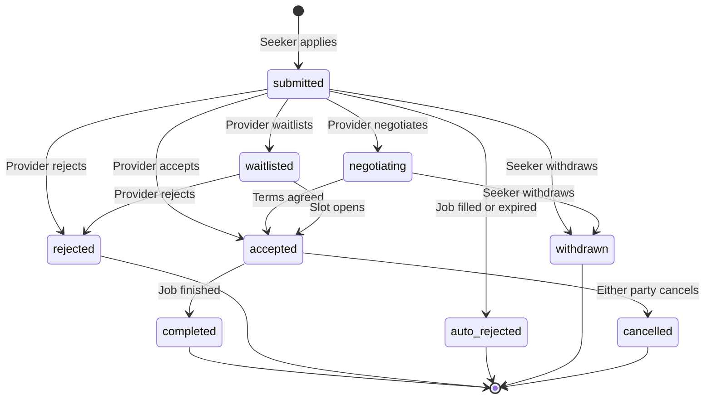

<div align="center">
  
</div>

> [!CAUTION]
> **PROPRIETARY AND CONFIDENTIAL**
> This repository, including all source code, assets, and documentation, is the exclusive property of Rezan Aaron Yalçin. Unauthorized copying, modification, distribution, execution, or commercial use is strictly prohibited. By accessing this repository, you are bound by the terms of the proprietary license.

---

## System Overview

JobBridge is a web platform that connects job seekers with private individuals and companies for everyday help and pocket money jobs. Users register as either a **Job Seeker** or a **Job Provider** (private person or company). Job seekers browse, filter, and apply to location-based job listings. Job providers create and manage postings, review applicants, and communicate through the built-in messaging system.

The platform enforces a guardian consent flow for minors, provider verification for companies, and role-based access control for internal staff (administrators, moderators, analysts). All data access is governed by Row Level Security policies at the database layer.

---

## Architecture

### High-Level System Architecture



**Account Types** determine what a user can do on the platform:
| Account Type | Provider Kind | Description |
| :--- | :--- | :--- |
| `job_seeker` | — | Browses and applies to jobs. Youth, adults, and seniors. |
| `job_provider` | `private` | Private individuals posting everyday help tasks. |
| `job_provider` | `company` | Registered businesses posting verified job listings. |

**System Roles** are assigned to internal staff members via the `user_system_roles` table:
| Role | Access |
| :--- | :--- |
| `admin` | Full system configuration, user management, all dashboards. |
| `moderator` | Reviews reports, moderates content, manages flagged users. |
| `analyst` | Read-only access to dashboards and metrics. |

---

### Guardian Consent Flow

Minors on the platform cannot apply to jobs until a legal guardian has verified their account. The flow uses a cryptographic token (SHA-256 hashed, stored in `guardian_invitations`) with a configurable expiration.



> **Gate:** When a minor attempts to apply for a job and `guardian_status` is not `linked`, the UI displays a `GuardianConsentModal` instead of the application form.

---

### Application Lifecycle

Every job application moves through a defined state machine. The `accept_applicant` RPC handles atomic status transitions on the database level.



| Status | Triggered By | Description |
| :--- | :--- | :--- |
| `submitted` | Seeker | Initial application with optional message. |
| `accepted` | Provider | Provider confirms the applicant for the job. |
| `rejected` | Provider | Provider declines the application with optional reason. |
| `auto_rejected` | System | Job was filled or expired before review. |
| `withdrawn` | Seeker | Seeker retracts their application. |
| `negotiating` | Provider | Provider opens a dialogue before accepting. |
| `waitlisted` | Provider | Applicant is held in reserve. |
| `completed` | Provider | Job was performed and finished. |
| `cancelled` | Either | Accepted job was cancelled before completion. |

---

### Job System

Jobs are created atomically via the `create_job_atomic` RPC, which inserts into both `jobs` and `job_private_details` in a single transaction. Sensitive location data (full address, private coordinates) is stored separately in `job_private_details` and only revealed based on the `address_reveal_policy`.

| Field | Values | Description |
| :--- | :--- | :--- |
| **Status** | `draft`, `open`, `closed`, `reviewing`, `reserved`, `filled` | Lifecycle state of the job listing. |
| **Hiring Mode** | `open_pool`, `first_come`, `direct_hire` | Controls how applications are collected and processed. |
| **Reach** | `internal_rheinbach`, `extended` | Visibility scope: local market only or cross-region. |
| **Address Reveal** | `after_apply`, `after_accept` | When applicants can see the full private address. |
| **Categories** | `garden`, `household`, `babysitting`, `tutoring`, `it_help`, `moving`, `pets`, `shopping`, `other` | Predefined categories with recommended wage ranges. |

---

## Security and Access Control

### Edge Middleware (Route Protection)

The `middleware.ts` runs on every request at the Vercel edge. It validates the session via Supabase Auth, resolves the user's system roles, and enforces route-level access:

| Route | Required Role |
| :--- | :--- |
| `/admin/*`, `/staff/*` | `admin` or `moderator` or `analyst` |
| `/analytics/*` | `admin` or `analyst` |
| `/moderation/*` | `admin` or `moderator` |
| `/app-home/*` | Any authenticated user |
| All other routes | Public |

Unauthenticated requests to protected routes are redirected to `/`. Authenticated users without sufficient roles are redirected to `/app-home`.

### Row Level Security (RLS)

Every table in the database has RLS enabled. Policies ensure:
- Users can only read and modify their own `profiles`, `applications`, `messages`, and `notifications`.
- Staff can view user data through explicit `has_system_role()` checks in policy definitions.
- Guardian invitations are only writable through `SECURITY DEFINER` RPCs, never directly.
- Moderation actions and reports are restricted to staff roles.

### Authentication States

The auth layer (`src/lib/auth.ts`) resolves every user into one of four states:

| State | Behavior |
| :--- | :--- |
| `no-session` | No valid JWT. Redirect to login. |
| `email-unconfirmed` | Account exists but email not verified via OTP. |
| `incomplete-profile` | Email verified but onboarding not finished. Redirect to `/onboarding`. |
| `ready` | Fully authenticated and onboarded. Access granted. |

### Effective Role Resolution

Staff members can temporarily assume a different account type view for debugging. The resolution priority is:
1. **Demo Mode** (highest priority) via `demo_sessions` table
2. **Role Override** via `role_overrides` table (with expiration)
3. **Base Profile** from `profiles.account_type`

---

## Database Schema

The database is defined in `infrastructure/database/schema.sql`. It contains 20+ tables, views, functions, and triggers. Below are the core tables:

| Table | Purpose |
| :--- | :--- |
| `profiles` | User data: name, birthdate, city, account type, provider kind, guardian status, coordinates, company fields. |
| `jobs` | Job listings: title, description, status, category, wage, hiring mode, reach, public location. |
| `job_private_details` | Sensitive job data (1:1 with jobs): full address, private coordinates, internal notes. |
| `applications` | Job applications: status, message, rejection reason. FK to jobs and profiles. |
| `messages` | In-app messaging scoped per application. Sender, content, read timestamp. |
| `notifications` | User notifications with type (`info`, `success`, `warning`, `error`, `message`) and metadata. |
| `notification_preferences` | Per-user email toggle settings, quiet hours, digest frequency. |
| `guardian_invitations` | Cryptographic consent tokens: SHA-256 hash, status, expiration, redeemed-by. |
| `guardian_relationships` | Links between guardians and minors. |
| `system_roles` | Role definitions: `admin`, `moderator`, `analyst`. |
| `user_system_roles` | M:N assignment of system roles to user profiles. |
| `role_overrides` | Temporary account type overrides for staff debugging. |
| `demo_sessions` | Sandbox mode state per user. |
| `regions_live` | Active market regions: city, postal code, federal state, display name. |
| `reports` | User/content reports: target type, reason code, status. |
| `moderation_actions` | Audit trail for moderator actions. |
| `security_events` | Security audit log: event type, IP address, user agent. |
| `waitlist` | Pre-launch signups by region. |
| `verification_attempts` | Rate limiting for OTP verification. |

**Key RPCs:** `create_job_atomic`, `accept_applicant`, `create_guardian_invitation`, `redeem_guardian_invitation`, `get_jobs_feed`, `has_system_role`, `is_admin`, `is_staff`, `get_effective_role`

---

## Project Structure

```text
jobbridge/
|-- infrastructure/
|   |-- database/
|   |   +-- schema.sql              # Master database schema (tables, RLS, RPCs, triggers)
|   +-- scripts/
|       +-- verify_application_flow.ts
|-- public/                          # Static assets
|-- src/
|   |-- app/
|   |   |-- layout.tsx               # Root layout
|   |   |-- page.tsx                 # Landing page
|   |   |-- actions/                 # Server actions (guardian, jobs)
|   |   |-- admin/                   # Admin dashboard, user mgmt, roles, moderation
|   |   |-- staff/                   # Staff dashboard (moderator/analyst views)
|   |   |-- app-home/               # Authenticated user home (jobs, applications, messages)
|   |   |-- auth/                    # Auth callbacks, password flows
|   |   |-- guardian/                # Guardian accept/access pages
|   |   |-- onboarding/             # Onboarding wizard and waitlist
|   |   |-- notifications/          # Notification center and settings
|   |   +-- api/                     # API routes (location, region, admin)
|   |-- components/
|   |   |-- ui/                      # Base UI primitives (buttons, inputs, cards)
|   |   |-- jobs/                    # Job cards, creation forms, feed
|   |   |-- applications/           # Application modals, status display
|   |   |-- profile/                # Profile views and edit forms
|   |   |-- onboarding/             # Onboarding wizard steps
|   |   |-- notifications/          # Notification list and badges
|   |   |-- offers/                  # Offer management components
|   |   |-- layout/                  # Navigation, sidebar, header
|   |   |-- admin/                   # Admin-specific components
|   |   +-- auth/                    # Auth forms and guards
|   |-- config/
|   |   +-- navigation.ts           # Route config (seeker vs. provider navigation)
|   |-- hooks/                       # Custom React hooks
|   +-- lib/
|       |-- auth.ts                  # Session management, auth state resolution
|       |-- security.ts              # Security event logging
|       |-- supabaseServer.ts        # Server-side Supabase client
|       |-- supabaseClient.ts        # Client-side Supabase client
|       |-- supabaseAdmin.ts         # Service-role Supabase client
|       |-- types.ts                 # Core type definitions (AccountType, ProviderKind, etc.)
|       |-- regions.ts               # Region configuration and fallbacks
|       |-- constants/               # Job categories, enums, static config
|       |-- dal/                     # Data Access Layer (job feed, applications, profiles)
|       |-- services/                # Business logic services
|       +-- types/                   # Generated Supabase types
|-- middleware.ts                    # Edge middleware (route protection, role checks)
+-- package.json
```

---

## Technology Stack

<div align="center">
  <a href="https://skillicons.dev">
    
  </a>
</div>
<br />

| Layer | Technology | Purpose |
| :--- | :--- | :--- |
| **Framework** | Next.js 16.1 (App Router) | Server-side rendering, edge middleware, server actions. |
| **UI** | React 19.2 | Component architecture, concurrent features. |
| **Styling** | Tailwind CSS v4, Framer Motion | Utility-first CSS, hardware-accelerated animations. |
| **Language** | TypeScript (strict) | End-to-end type safety. |
| **Backend** | Supabase (PostgreSQL 15, GoTrue Auth) | Database, authentication, real-time, storage. |
| **Geospatial** | Leaflet, MapLibre GL | Interactive maps, distance calculations (Haversine). |
| **Validation** | Zod | Runtime schema validation for forms and server actions. |
| **Hosting** | Vercel | Edge deployment, serverless functions, CDN. |

---

## Local Development

1. **Install dependencies:**
   ```bash
   npm install
   ```

2. **Configure environment variables** — create `.env.local` in the project root:
   ```bash
   NEXT_PUBLIC_SUPABASE_URL=<your-supabase-url>
   NEXT_PUBLIC_SUPABASE_ANON_KEY=<your-anon-key>
   SUPABASE_SERVICE_ROLE_KEY=<your-service-role-key>
   ```

3. **Initialize the database** — execute the master schema in your Supabase SQL Editor:
   ```
   infrastructure/database/schema.sql
   ```
   This creates all tables, enums, RLS policies, functions, triggers, and seeds the system roles.

4. **Start the development server:**
   ```bash
   npm run dev
   ```
   The application runs at `http://localhost:3000`.

---

## License and Legal Terms

> [!WARNING]
> **STRICTLY PROPRIETARY AND CONFIDENTIAL**
> 
> **Copyright (c) 2026 Rezan Aaron Yalçin. All rights reserved.**
> 
> This software is governed by the **JOBBRIDGE PROPRIETARY LICENSE**.
> 
> By accessing, viewing, or interacting with this repository in any capacity, you are legally bound by the following terms:
> 
> 1. **Absolute Ownership**: The Software is proprietary and owned exclusively by the Licensor. All intellectual property rights remain strictly with the Licensor.
> 2. **Zero License Granted**: No license is granted under any copyright, patent, trademark, trade secret, or other intellectual property right.
> 3. **Restricted Access**: Permission is granted solely to access and view the Software via this repository for evaluation and informational purposes.
> 4. **Prohibited Actions**: You are explicitly forbidden to:
>    - Copy, reproduce, download, clone, mirror, or archive the Software.
>    - Modify, adapt, translate, or create derivative works.
>    - Compile, run, execute, or use the Software for any purpose whatsoever.
>    - Distribute, publish, sublicense, sell, rent, lease, or lend the Software.
>    - Use the Software in any commercial product, service, or AI training dataset.
>    - Remove, alter, or obscure any copyright or proprietary notices.
> 
> **ENFORCEMENT**: Any breach of these terms terminates the limited permission immediately and automatically. The Licensor reserves the right to pursue all available legal remedies under the laws of the Federal Republic of Germany. For the complete legal text, refer to the `License` file located in the root directory.

---

<div align="center">
  
</div>

<div align="center">
  <sub>JobBridge &copy; 2026 Rezan Aaron Yalçin — All Rights Reserved.</sub>
</div>
