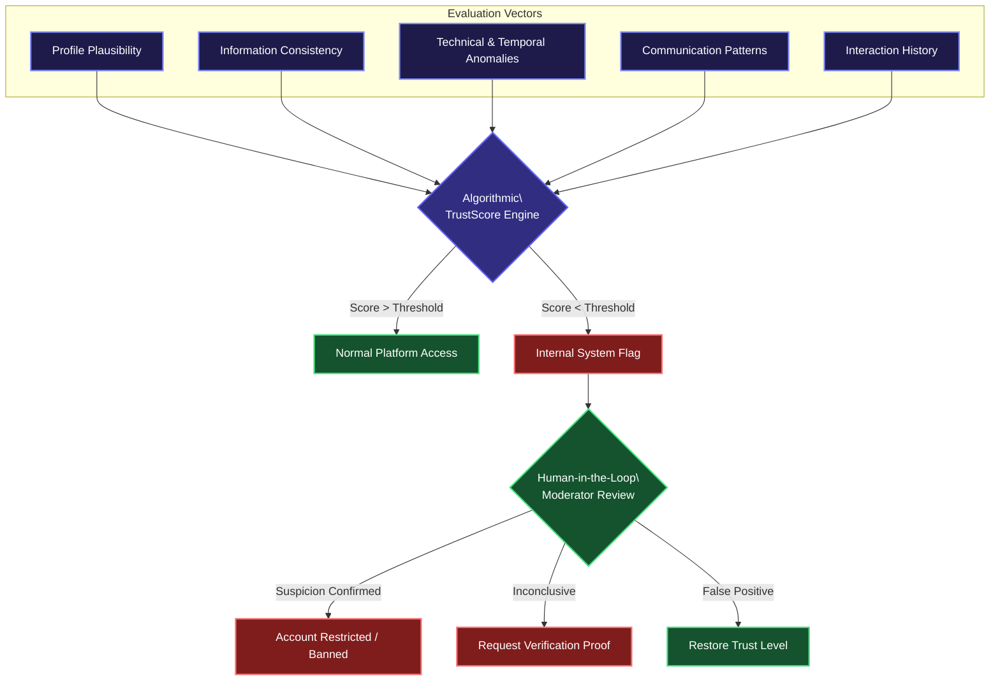
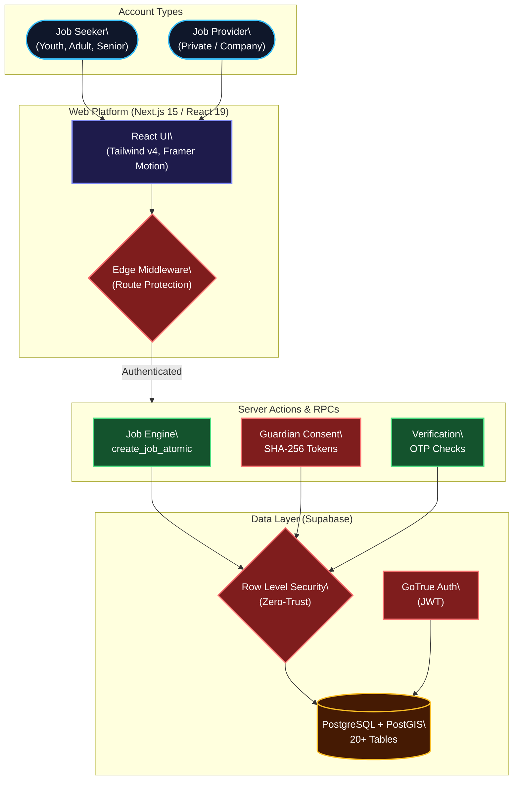

<div align="center">
  
</div>

> [!CAUTION]
> **PROPRIETARY AND STRICTLY CONFIDENTIAL**
> This repository, including all source code, assets, UI/UX designs, and documentation, is the exclusive intellectual property of Rezan Aaron Yalçin. Unauthorized copying, modification, distribution, or commercial use is strictly prohibited. By accessing this repository, you agree to be bound by the proprietary license terms outlined at the bottom of this document.

---

## ✦ System Overview

Welcome to the **JobBridge Web Platform**. 

JobBridge is a high-end platform connecting job seekers (youth, adults, seniors) with private individuals and companies for everyday tasks and pocket-money jobs. This repository specifically houses our **Web Application**—a highly optimized, PWA-ready Next.js 15 environment that delivers a native, app-like experience directly in the browser. *(Note: Our native iOS and Android applications are maintained in separate, dedicated repositories).*

Our engineering philosophy prioritizes three pillars: **Uncompromising Security**, **Cinematic UX/UI**, and **Scalable Architecture**.

---

## ⚡️ TrustScore: Predictive Security Algorithm

Beyond classic reporting systems, JobBridge utilizes a sophisticated, proprietary **TrustScore Algorithm (0-10)** functioning dynamically in the background. 

This is **not a public rating system**. It is an internal, multi-signal risk evaluation matrix designed to detect suspicious patterns early and protect our community proactively.



### Core Principles
1. **Protection by Design:** Highly sensitive actions require sufficient baseline trust.
2. **Hidden Weights:** To prevent exploitation or "gaming" of the algorithm, the precise calculation weights, specific triggers, and thresholds remain strictly internal and continuously optimized.
3. **Role-Specific Logic:** Youth accounts and Provider accounts are evaluated against different risk vectors.
4. **Human-in-the-Loop:** The algorithm surfaces threats; human moderators make the final call (requesting further proof or restricting access).

---

## 🛡️ The Guardian Consent Flow

We ensure absolute legal compliance and safety for minors on the platform. Youth accounts operate under a strict "Gate" and cannot apply to jobs until a legal guardian has cryptographically verified the connection.

**The Workflow:**
1. **Initiation:** The minor registers and generates a secure, one-time invitation link within the JobBridge app.
2. **Transmission:** The minor shares this unique link directly with their legal guardian.
3. **Guardian Registration:** The parent clicks the link and is prompted to create their *own* JobBridge account, passing our standard basic verification.
4. **Official Approval:** Using their verified account, the parent officially grants consent for the minor.
5. **Cryptographic Linking:** The system redeems the SHA-256 hashed token, linking the two accounts (`guardian_status = linked`). The parent retains administrative oversight, and the minor is granted full platform access.

---

## 🔄 Application Lifecycle & Waitlist Mechanics

JobBridge utilizes a highly efficient **Single Hiring Mode** designed to eliminate application frustration.

Instead of allowing 50 people to apply for a job that is already promised to someone else, we use an automated reservation and waitlist system:

1. **Application & Reservation:** When the first user applies, the job is immediately marked as `reserved`. It is instantly removed from the active, open job marketplace for everyone else.
2. **The Waitlist Market:** The reserved job transitions into the specialized "Waitlist Marketplace".
3. **Joining the Queue:** Other interested users can view the job in the Waitlist Market and explicitly join the queue (taking 2nd, 3rd, or 4th place).
4. **Automatic Promotion:** If the primary applicant withdraws, or if the job provider cancels the arrangement because an agreement wasn't reached, the system automatically promotes the 2nd place user to the active slot, instantly notifying all parties.

---

## 🏗️ High-Level System Architecture



---

## 🛠️ Database Schema Hierarchy

Our PostgreSQL Database (managed via Supabase) operates under strict Row Level Security (RLS). No query bypasses the policy checks.

| Table | Purpose | Security Concept |
| :--- | :--- | :--- |
| `profiles` | Name, city, account type, guardian status. | RLS: Users can only mutate their own ID. |
| `jobs` | Public listing data (title, category, wage). | RLS: Public read, Author mutate only. |
| `job_private_details` | Sensitive location data (full address, private lat/lng). | Revealed strictly based on `address_reveal_policy` (e.g., post-acceptance). |
| `applications` | Status engine (reserved, waitlisted, accepted). | Links `jobs` to applicant `profiles`. |
| `guardian_invitations` | SHA-256 hashed cryptographic consent tokens. | Written ONLY via `SECURITY DEFINER` RPCs. |
| `guardian_relationships` | Active links binding minors to verified guardians. | Managed exclusively by secure server flows. |
| `system_roles` | Role definitions (admin, moderator, analyst). | Static seed data globally read-only. |
| `user_system_roles` | Admin, Moderator, and Analyst assignments. | Used globally in RLS `has_system_role()` checks. |
| `security_events` | Security audit logging (IP, user agent actions). | Append-only. Visible to analysts/admins. |
| `reports` | User moderation reports against jobs or messages. | Target-type specific. |
| `moderation_actions` | Audit trail for human-in-the-loop decisions. | Traceable back to specific staff ID. |
| `notification_preferences` | Per-user control for email digests/quiet hours. | RLS: Users manage their own preferences. |
| `notifications` | In-app automated alert system. | Private notification feed. |
| `messages` | Escrowed communication within active job applications. | Only accessible per application participants. |
| `regions_live` | Geographic boundaries for active service markets. | Managed by admins. |

---

## 💻 Elite Technology Stack

JobBridge leverages the absolute pinnacle of modern web development frameworks to ensure enterprise-level scalability and a flawless user experience.

<div align="center">
  <br />
  
  [](https://nextjs.org/)
  [](https://react.dev/)
  [](https://supabase.com/)
  [](https://tailwindcss.com/)
  [](https://www.framer.com/motion/)
  [](https://www.typescriptlang.org/)
  [](https://vercel.com/)
</div>

<br />

---

## 🚀 Local Development Setup

> [!IMPORTANT]
> **Authorized Access Only**
> While this repository is public for transparency and portfolio purposes, the source code remains strictly proprietary. Attempting to run this platform locally without authorized access to the JobBridge staging database and environment will fail.

To boot the JobBridge Web Platform locally (authorized contributors only):

### 1. Prerequisites
- **Node.js**: `v20.x` LTS minimum.
- **Backend**: You require authorized access to the JobBridge Supabase staging environment.

### 2. Initialization

```bash
git clone https://github.com/JobBridge-app/app.git
cd app
npm install
```

### 3. Environment Configuration
> [!TIP]
> **Mini-Hint:** Without these exact keys in a `.env.local` file at the root of the project, the Edge Middleware will instantly reject connections.

```env
NEXT_PUBLIC_SUPABASE_URL=your_project_url
NEXT_PUBLIC_SUPABASE_ANON_KEY=your_anon_key
SUPABASE_SERVICE_ROLE_KEY=your_service_role_key
```

### 4. Boot Engine

```bash
npm run dev
```

The platform compiles and boots at **[http://localhost:3000](http://localhost:3000)**. Enjoy the cinematic experience.

---

## License and Legal Terms

> [!CAUTION]
> **STRICTLY PROPRIETARY AND CONFIDENTIAL**
> 
> **Copyright (c) 2026 Rezan Aaron Yalçin. All rights reserved.**
> 
> This software is governed by the **JOBBRIDGE PROPRIETARY LICENSE**. No license is granted under any copyright, patent, trademark, trade secret, or other intellectual property right.
> 
> You are explicitly forbidden to:
> - Copy, clone, mirror, or archive the Software.
> - Modify, adapt, or create derivative works.
> - Distribute, publish, sell, or use the Software in any commercial product or AI training dataset.
> 
> **ENFORCEMENT**: The Licensor reserves the right to pursue all available legal remedies under the laws of the Federal Republic of Germany for any breach of these terms.

<br/>

<div align="center">
  
</div>

<div align="center">
  <sub>JobBridge Web Platform &copy; 2026 Rezan Aaron Yalçin — All Rights Reserved.</sub>
</div>
